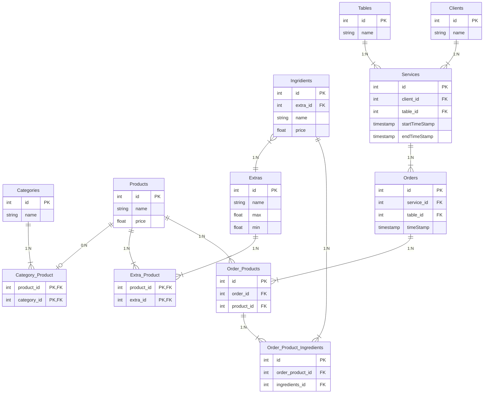

# a-la-carta-api
API for managing the actions of the "A la Carta" application

```mermaid
erDiagram
    Categories {
        int id PK
        string name
    }
    Category_Product {
        int product_id PK, FK
        int category_id PK, FK
    }
    Products {
        int id PK
        string name
        float price
    }
    Products ||--|o Category_Product : "0:N"
    Categories ||--|{ Category_Product : "1:N"
    Extras {
        int id PK
        string name
        float max
        float min
    }
    Extra_Product {
        int product_id PK, FK
        int extra_id PK, FK
    }
    Extras ||--|{ Extra_Product : "1:N"
    Products ||--|{ Extra_Product : "1:N"
    Ingridients {
        int id PK
        int extra_id FK
        string name
        float price
    }
    Ingridients }|--|| Extras : "1:N"
    Tables {
        int id PK
        string name
    }
    Clients {
        int id PK
        string name
    }
    Services {
        int id PK
        int client_id FK
        int table_id FK
        timestamp startTimeStamp
        timestamp endTimeStamp
    }
    Tables ||--|{ Services : "1:N"
    Clients ||--|{ Services : "1:N"
    Orders {
        int id PK
        int service_id FK
        int table_id FK
        timestamp timeStamp
    }
    Services ||--|{ Orders : "1:N"
    Order_Products {
        int id PK
        int order_id FK
        int product_id FK
    }
    Products ||--|{ Order_Products : "1:N"
    Orders ||--|{ Order_Products : "1:N"
    Order_Product_Ingredients {
        int id PK
        int order_product_id FK
        int ingredients_id FK
    }
    Ingridients ||--|{ Order_Product_Ingredients : "1:N"
    Order_Products ||--|{ Order_Product_Ingredients : "1:N"
```
